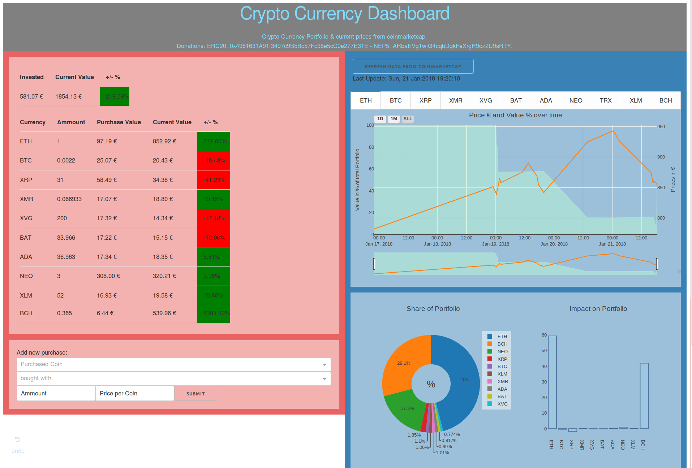

?raw=true# Dash/ Plotly Crypto Currency Dasboard

This is a dashboard for Cryptocurrencies based on [plotly.js](https://plot.ly/) & [dash](https://plot.ly/products/dash/). It utilizes the [coinmarketcap API](https://coinmarketcap.com/api/) get the current prices of your coins and calculates the development of your assets based on your fiat investments. If you want to know more about the functionality and the different graphs, check out: 

## Getting started

### Install necesarry 3rd party libraries:?raw=true

    pip install plotly
    pip install dash?raw=true
    pip install sqlalchemy
    pip install coinmarketcap
    pip install numpy
    pip install pandas
    
### Clone repository to you machine

    git clone https://github.com/elpunkt/coin-dashboard.git

### Start the server

    python dash-board.py

### Open the UI and add your first purchase

Open http://127.0.0.1:8050/ in a browser of your choice. Add your first purchase of a crypto currency for a **fiat currency**. Later purchases can be added based on a cryptocurrency that you already have in your portfolio, but to begin with, you need fiat money in the system as your investment;)

### Note:
There are no opt-ins or internal checks, if the inputs you made are consistent. If you add a wrong purchase, you have to make it undone yourself, either by using the UI or by altering the DB directly.

This project might be developed further if there is any interest in it, but so far it fits my needs. However, feel free to add PRs and I will consider to add further functionality.
